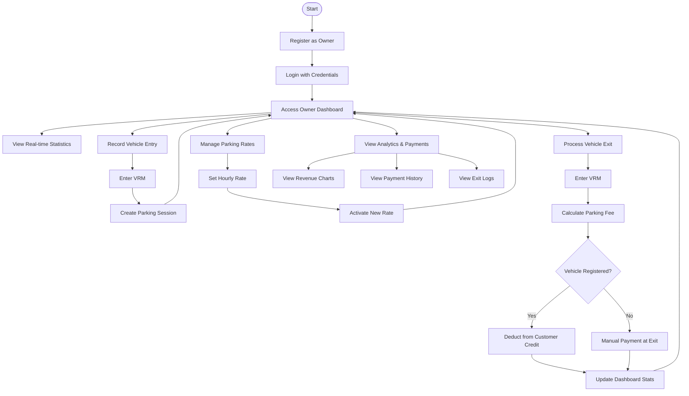
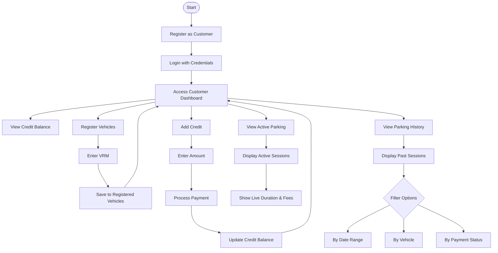

# Frontend User Flow Diagrams(Owner/Customer)

Complete user flow guide for the Car Parking Management System, covering both Owner and Customer journeys.

---

## Flow Diagrams

### Owner Flow Diagram

### Customer Flow Diagram

