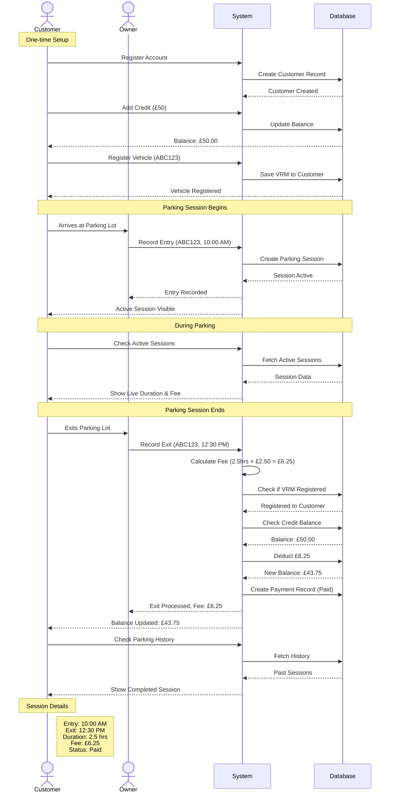

# Frontend User Flow Documentation

Complete user flow guide for the Car Parking Management System, covering both Owner and Customer journeys from registration to payment generation.

---

## Flow Diagrams

### Owner Flow Diagram

### Customer Flow Diagram

### Complete Transaction Sequence Diagram

---
