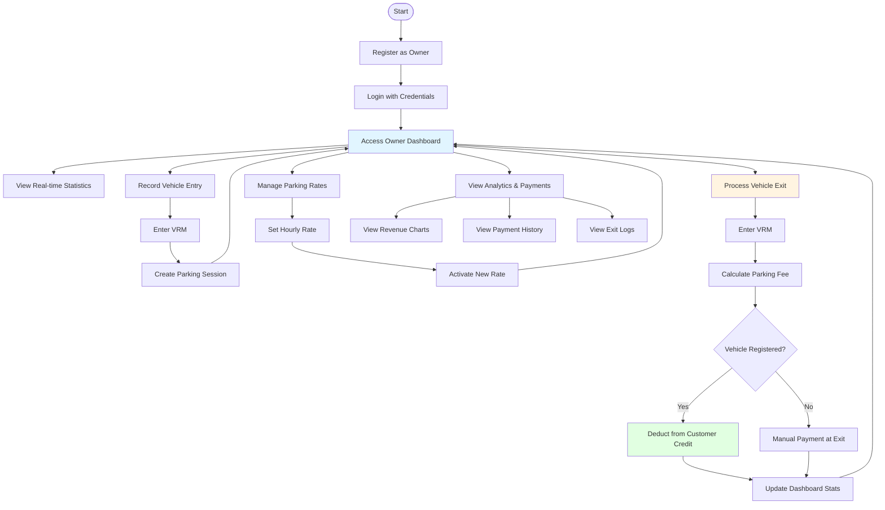
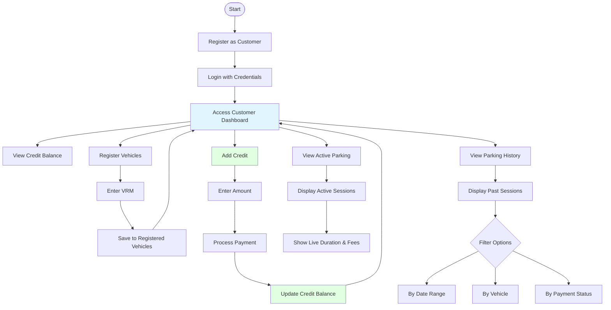
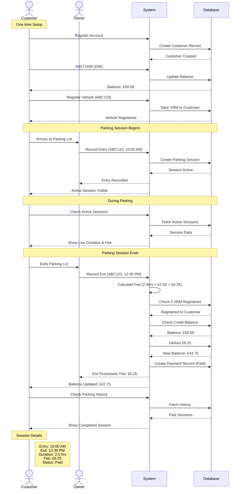

# Frontend User Flow Documentation

Complete user flow guide for the Car Parking Management System, covering both Owner and Customer journeys from registration to payment generation.

---

## Flow Diagrams

### Owner Flow Diagram

### Customer Flow Diagram

### Complete Transaction Sequence Diagram

---

## Owner Flow (Parking Lot Operator)

### 1. Registration & Authentication

1. Navigate to the registration page
2. Fill in registration form with:
   - Full Name
   - Email Address
   - Password
   - **Role**: Select "Owner"
3. Submit registration
4. System redirects to login page
5. Login with credentials (JWT token stored in cookies)

### 2. Dashboard Access

After login, owner is directed to the Owner Dashboard showing:

- **Real-time Statistics**:
  - Total vehicles currently parked
  - Available parking capacity
  - Today's revenue
  - Average parking duration
- **Weekly Revenue Chart**: Visual representation of the last 7 days
- **Recent Activity**: Latest vehicle entries and exits

### 3. Recording Vehicle Entry

1. Navigate to "Movements" section
2. Select "Record Entry" tab
3. Enter Vehicle Registration Mark (VRM)
4. Submit entry
5. System creates a new parking session with:
   - Entry timestamp
   - Vehicle details
   - Active status

### 4. Managing Parking Rates

1. Navigate to "Parking Rates" section
2. View current active rate
3. To add new rate:
   - Enter rate per hour (e.g., £2.50)
   - Enter rate name/description
   - Submit
4. New rate becomes active immediately
5. Previous rate is automatically deactivated

### 5. Processing Vehicle Exit

1. Navigate to "Movements" section
2. Select "Record Exit" tab
3. Enter Vehicle Registration Mark (VRM)
4. System calculates:
   - Total parking duration
   - Parking fee based on active rate
   - Payment status
5. Submit exit
6. System:
   - Updates vehicle status to exited
   - Creates payment record
   - Deducts fee from customer's credit (if registered)
   - Updates dashboard statistics

### 6. Viewing Analytics

1. Navigate to "Payments" section to view:
   - All payment transactions
   - Payment status (Paid/Unpaid)
   - Revenue summaries
   - Filter by date range
2. Check "Exit Logs" for:
   - Complete history of vehicle exits
   - Duration and fees
   - Payment details

---

## Customer Flow (Vehicle Owner)

### 1. Registration & Authentication

1. Navigate to the registration page
2. Fill in registration form with:
   - Full Name
   - Email Address
   - Password
   - **Role**: Select "Customer"
3. Submit registration
4. System creates account with:
   - Initial credit balance: £0.00
   - Empty vehicle list
5. Login with credentials (JWT token stored in cookies)

### 2. Dashboard Access

After login, customer is directed to the Customer Dashboard showing:

- **Credit Balance**: Current available credit
- **Registered Vehicles**: List of all VRMs
- **Active Parking Sessions**: Currently parked vehicles
- **Parking History**: Past parking sessions

### 3. Registering Vehicles

1. Navigate to "Vehicles" section
2. Click "Add Vehicle" or similar action
3. Enter Vehicle Registration Mark (VRM)
4. Submit
5. Vehicle is added to customer's registered vehicles list
6. Can register multiple vehicles

### 4. Adding Credit Balance

1. Navigate to "Credit" or "Add Credit" section
2. Enter amount to add (e.g., £50.00)
3. Select payment method (simulated in development)
4. Submit transaction
5. Credit is immediately added to account balance
6. Can view transaction in payment history

### 5. Viewing Active Parking Sessions

1. Check Customer Dashboard
2. "Active Parking" section displays:
   - Currently parked vehicles
   - Entry timestamp
   - Current duration
   - Estimated fee (calculated in real-time)
   - Parking location

### 6. Parking History & Payments

1. Navigate to "History" or "Payments" section
2. View all past parking sessions:
   - Entry and exit timestamps
   - Duration
   - Parking fee charged
   - Payment status (Paid/Pending)
3. Filter by:
   - Date range
   - Vehicle (VRM)
   - Payment status

### 7. Automatic Payment Processing

When vehicle exits:

1. Owner records exit at gate
2. System calculates parking fee
3. If customer has registered vehicle:
   - Fee is automatically deducted from credit balance
   - Payment status marked as "Paid"
   - Customer receives updated balance
4. If insufficient credit:
   - Payment marked as "Pending"
   - Customer notified to add credit
5. If unregistered vehicle:
   - Payment processed separately (cash/card at exit)

### 8. Managing Account

1. View profile details
2. Update personal information
3. View credit transaction history
4. Manage registered vehicles:
   - Add new vehicles
   - View all registered VRMs
   - Track usage per vehicle

---

## Complete Transaction Flow

### Scenario: Customer Parks and Exits

**Step-by-Step Process:**

#### Customer Side (Before Parking):

1. Customer registers account (one-time)
2. Adds credit balance (£50.00)
3. Registers vehicle VRM "ABC123"
4. Drives to parking lot

#### Owner Side (Entry):

5. Owner records entry: "ABC123" enters at 10:00 AM
6. System creates active parking session

#### System (During Parking):

7. Parking session tracked in real-time
8. Dashboard shows vehicle count and capacity
9. Customer can view active session in their dashboard

#### Owner Side (Exit):

10. Vehicle exits at 12:30 PM (2.5 hours parked)
11. Owner records exit: "ABC123"
12. System calculates fee: 2.5 hours × £2.50/hour = £6.25

#### System (Payment Processing):

13. Checks if "ABC123" is registered → Yes, belongs to customer
14. Checks customer credit balance → £50.00 available
15. Deducts £6.25 from customer credit
16. Updates credit balance to £43.75
17. Creates payment record with status "Paid"
18. Updates dashboard statistics

#### Customer Side (After Exit):

19. Customer sees updated credit balance: £43.75
20. Parking history shows completed session:
    - Entry: 10:00 AM
    - Exit: 12:30 PM
    - Duration: 2.5 hours
    - Fee: £6.25
    - Status: Paid

---

## Key Features of the System

### Role-Based Access Control

- **Owner Dashboard**: Focused on operations, analytics, and revenue tracking
- **Customer Dashboard**: Focused on personal vehicles, credit, and parking history
- Separate navigation and features based on user role

### Authentication & Security

- JWT token-based authentication
- Secure cookie storage
- Role validation on every request
- Protected routes and endpoints

### Real-Time Updates

- Dashboard statistics update immediately after transactions
- Live parking duration calculation
- Instant credit balance updates
- Current capacity tracking

### Automatic Payment System

- Seamless fee deduction from customer credit
- Automatic payment status tracking
- Handles registered and unregistered vehicles
- Low balance notifications

### Multi-Vehicle Support

- Customers can register unlimited vehicles
- Track each vehicle's parking history independently
- View active sessions across all registered vehicles

### Comprehensive History & Analytics

- **Owner**: Revenue charts, payment summaries, exit logs
- **Customer**: Parking history, credit transactions, payment status
- Date range filtering
- Export capabilities (future enhancement)

### Flexible Credit Management

- Prepaid parking system
- Easy credit top-up
- Transaction history
- Balance tracking

---

## UI/UX Highlights

### Navigation

- Clean, intuitive navigation bar
- Role-specific menu items
- Quick access to frequently used features
- Responsive design for mobile and desktop

### Dashboard Design

- Card-based layout for statistics
- Color-coded status indicators
- Interactive charts and graphs
- Real-time data display

### Form Validation

- Client-side validation for all inputs
- Clear error messages
- Success feedback
- Loading states during API calls

### Notifications

- Success messages for completed actions
- Error alerts for failed operations
- Warning prompts for low credit balance
- Confirmation dialogs for critical actions

---

## Future Enhancements

- Mobile app version
- Email notifications for parking sessions
- QR code integration for faster entry/exit
- Reservation system for parking spots
- Payment gateway integration
- Multi-location support
- Advanced analytics and reporting
- Customer loyalty program
